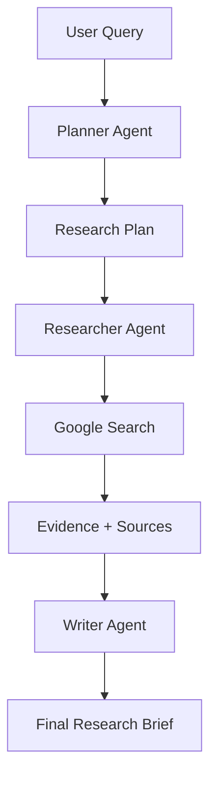

<div align="center">

# 🚀 ResearchPilot AI

### Multi-Agent Research Intelligence Platform Powered by Google ADK + Gemini

Transform complex questions into **structured, cited, professional research briefs** using autonomous AI agents.

[]()
[]()
[]()
[]()
[]()

</div>

---

# 📌 Overview

**ResearchPilot AI** is a production-grade multi-agent SaaS platform that automates deep research workflows.

Instead of relying on a single prompt-response model, ResearchPilot uses a **sequential AI agent pipeline** where specialized agents collaborate to:

- Understand user intent  
- Build an investigation strategy  
- Gather grounded real-time information  
- Generate executive-grade research reports  

Built with **Google Agent Development Kit (ADK)** and powered by **Gemini 2.5 Flash**.

---

# ✨ Core Features

## 🤖 Multi-Agent Intelligence

Three autonomous agents collaborate in sequence:

| Agent | Responsibility |
|------|----------------|
| **Planner Agent** | Converts prompts into structured research plans |
| **Researcher Agent** | Executes search + gathers cited evidence |
| **Writer Agent** | Produces polished markdown briefs |

---

## 🌐 Real-Time Grounding

Integrated with **Google Search** to ensure:

- Fresh information  
- Reduced hallucinations  
- Source-backed outputs  
- Reliable market / trend research

---

## 🛡️ Production Security

- Firebase Google Authentication  
- JWT Token Validation  
- Rate Limiting with `slowapi`
- Protected research endpoints  
- Session cleanup workflows

---

## 🧠 Persistent Memory

Uses Vertex AI Session + Memory systems for:

- Research continuity  
- Context retention  
- Multi-session intelligence

---

## 🎨 Premium Frontend

Modern responsive UI built using:

- React
- Vite
- Tailwind CSS
- Glassmorphism design system

---

# 🏗️ System Architecture



---

# 🧰 Tech Stack

| Layer | Technology |
|------|------------|
| Frontend | React + Vite + Tailwind |
| Backend | FastAPI |
| AI Framework | Google ADK |
| LLM | Gemini 2.5 Flash |
| Search Grounding | Google Search |
| Authentication | Firebase Auth |
| Database | Firestore |
| Hosting | Google Cloud Run |

---

# 🚀 Quick Start

# 1️⃣ Clone Repository

```bash
git clone https://github.com/yourusername/researchpilot-ai.git
cd researchpilot-ai
```

---

# 2️⃣ Backend Setup

Create `.env`

```env
GOOGLE_CLOUD_PROJECT=your-project-id
GOOGLE_CLOUD_LOCATION=us-central1
AGENT_ENGINE_ID=your-engine-id
FIREBASE_PROJECT_ID=your-firebase-id
GOOGLE_APPLICATION_CREDENTIALS=./service-account.json
MODEL_ID=gemini-2.5-flash
```

Install dependencies:

```bash
cd backend

python -m venv venv
source venv/bin/activate

pip install -r requirements.txt
uvicorn main:app --reload --port 8080
```

---

# 3️⃣ Frontend Setup

Create:

```env
frontend/.env.local
```

Add:

```env
VITE_FIREBASE_API_KEY=your-key
VITE_FIREBASE_AUTH_DOMAIN=your-domain
VITE_FIREBASE_PROJECT_ID=your-project
VITE_API_URL=http://localhost:8080
```

Run frontend:

```bash
cd frontend
npm install
npm run dev
```

---

# 🔐 Security Design

## Authentication Flow

1. User signs in with Google  
2. Firebase issues secure JWT  
3. Backend verifies token  
4. User UID attached to request  
5. Research history saved privately

---

## Rate Limits

```text
5 Research Requests / Minute / User
```

Helps protect:

- API abuse  
- Bot traffic  
- Excessive token costs

---

# 🧪 Testing

Run end-to-end pipeline tests:

```bash
bash test_e2e.sh
```

---

# 📂 Project Structure

```bash
researchpilot-ai/
│── backend/
│   ├── agents/
│   ├── middleware/
│   ├── services/
│   └── main.py
│
│── frontend/
│   ├── src/
│   ├── components/
│   └── pages/
│
│── test_e2e.sh
│── README.md
```

---

# 🌍 Use Cases

- Market Research  
- Startup Validation  
- Competitor Analysis  
- Academic Summaries  
- Industry Reports  
- Trend Discovery  
- Product Research

---

# 📈 Future Roadmap

- [ ] PDF Export Reports  
- [ ] Team Workspaces  
- [ ] Citation Viewer  
- [ ] Streaming Responses  
- [ ] Voice Research Assistant  
- [ ] Research Templates  
- [ ] Slack / Notion Integrations

---

# 🤝 Contributing

Contributions are welcome.

1. Fork repository  
2. Create feature branch  
3. Commit changes  
4. Submit Pull Request

---

# 📜 License

Licensed under the **Apache 2.0 License**

---

<div align="center">

### Built with ❤️ using Google Gemini + Google ADK

**ResearchPilot AI — The Future of Autonomous Research**

</div>