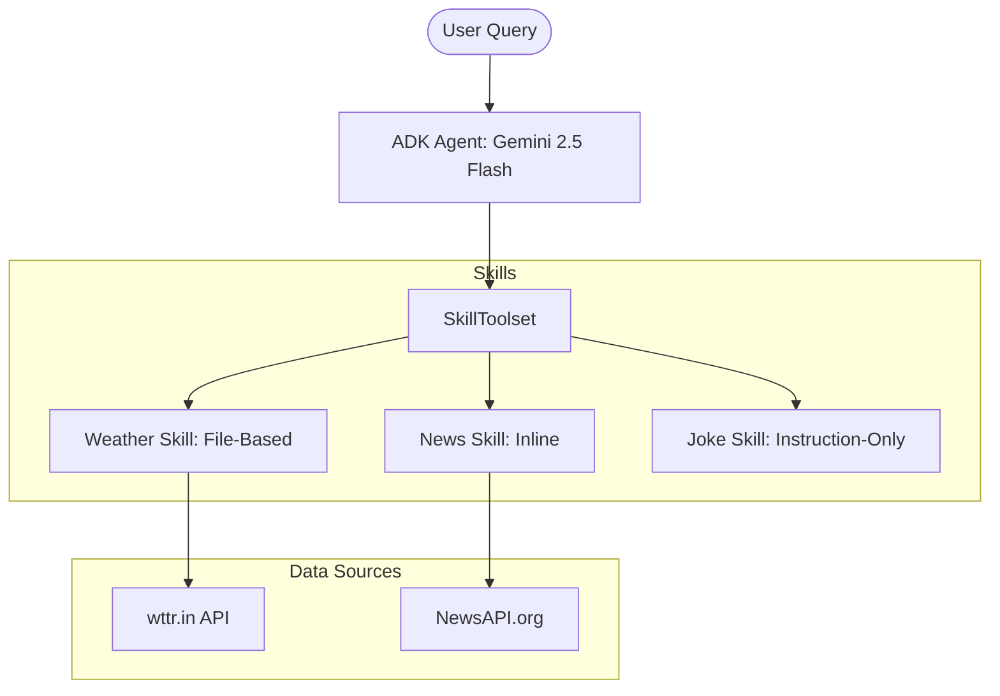

# Daily Briefing Agent (Google ADK)

A conversational AI agent built with **Google Agent Development Kit (ADK)** that provides live weather updates, global news headlines, and a daily joke. This project demonstrates the power of **Agent Skills**—both file-based and inline—and features advanced routing using Gemini 2.5 Flash.

## ✨ Features
- **Weather Skill (File-Based)**: Fetches real-time data from `wttr.in`. Includes a city alias system (`CITIES.md`) to handle historical names like "Bombay" or "Bangalore" silently.
- **News Skill (Inline)**: Dynamic summarizer using `NewsAPI.org`. Supports categories like Technology, Business, Science, and Sports (including specific support for Cricket/Football queries).
- **Joke-of-the-Day Skill**: An instruction-only skill demonstrating how agents can use L3 reference content (`FORMATS.md`) to generate creative content without external tools.
- **Progressive Disclosure**: High-level instructions are always available, while detailed formatting guides are loaded only when needed.

---

## 🏗️ Architecture



---

## 🚀 Quick Start

### 1. Prerequisites
- Python 3.10+
- [Google AI Studio API Key](https://aistudio.google.com/apikey)
- [NewsAPI.org Key](https://newsapi.org/register)

### 2. Setup
```bash
# Clone and enter directory
cd daily_briefing_agent

# Create and activate virtual environment
python3 -m venv venv
source venv/bin/activate

# Install dependencies
pip install -r requirements.txt
```

### 3. Environment Variables
Create a `.env` file in the root:
```env
GOOGLE_API_KEY=your_gemini_api_key
NEWS_API_KEY=your_news_api_key
```

### 4. Run the Agent
**Web UI:**
```bash
adk web --port 8002 .
# Open http://localhost:8002 in your browser
```

**CLI Tool:**
```bash
adk run .
```

---

## 🛠️ Project Structure
```text
daily_briefing_agent/
├── daily_briefing_agent/     # Agent Discovery Directory
│   ├── agent.py              # Main logic, Inline Skills & Tool Handlers
│   ├── __init__.py           # Required for ADK discovery
│   └── skills/               
│       └── weather-skill/    # File-based skill
│           ├── SKILL.md      # L1/L2 Instructions
│           └── references/   # L3 Progressive Disclosure docs
├── .env                      # API Secrets
└── requirements.txt          # Python Dependencies
```

## 🤝 Project Origin
Built as part of the "Your First Google ADK Agent with Skills" tutorial. Modified to include extended sports news support, city name alias resolving, and instruction-only skill patterns.
